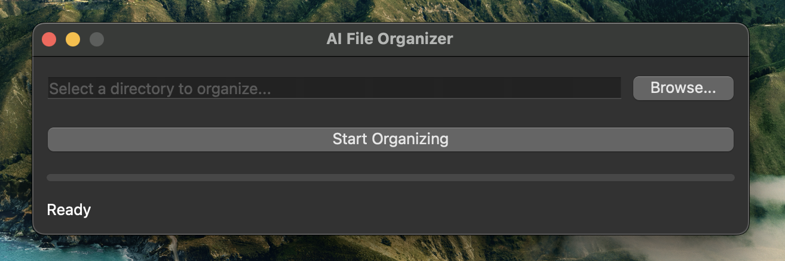

# Gemini-Powered AI File Organizer

An intelligent file organizer that uses the Gemini API to categorize your files and folders.

## Features

*   **AI-Powered Categorization:** Uses the Gemini API to intelligently categorize files and folders based on their name and content.
*   **Simple and Intuitive GUI:** A clean and easy-to-use graphical user interface built with PyQt6.
*   **macOS Native Look and Feel:** Designed to integrate seamlessly with the macOS desktop environment.
*   **Debug Mode:** A debug mode to test the application without making actual API calls.
*   **Packaged Application:** Comes as a standalone `.app` bundle for easy installation and use on macOS.

## Screenshot


<br>


## Installation and Usage

### For macOS Users

1.  Download the `Gemini-Powered AI File Organizer.app.zip` from the [latest release](https://github.com/jnadolski/ai-file-organizer/releases/latest).
2.  Drag the application to your `Applications` folder.
3.  Double-click the application to run it.

### For Windows Users

1.  Download the `Gemini-Powered AI File Organizer-Windows.zip` from the [latest release](https://github.com/jnadolski/ai-file-organizer/releases/latest).
2.  Extract the contents of the `.zip` file to a folder of your choice.
3.  Navigate to the extracted folder and double-click `Gemini-Powered AI File Organizer.exe` to run the application.
4.  **Important Note for Windows Users:** Your antivirus software (e.g., Windows Defender) might flag the executable as a false positive because it is not digitally signed. If this happens, you may need to temporarily disable real-time protection to download/extract the file, and then add an exclusion for the application folder in your antivirus settings.

### For Developers

1.  **Clone the repository:**
    ```bash
    git clone https://github.com/your-username/your-repo.git
    cd your-repo
    ```
2.  **Set up the environment:**
    ```bash
    python3 -m venv venv
    source venv/bin/activate
    pip install -r requirements.txt
    ```
3.  **Run the application:**
    ```bash
    python gui.py
    ```
4.  **Run in debug mode:**
    ```bash
    python gui.py --debug_skip_api
    ```

## Packaging

This project uses `py2app` to create the macOS application bundle. To build the application, run the following command:

```bash
python setup.py py2app
```

The application will be created in the `dist` directory.
